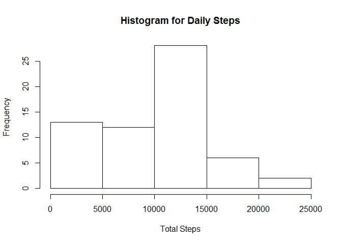
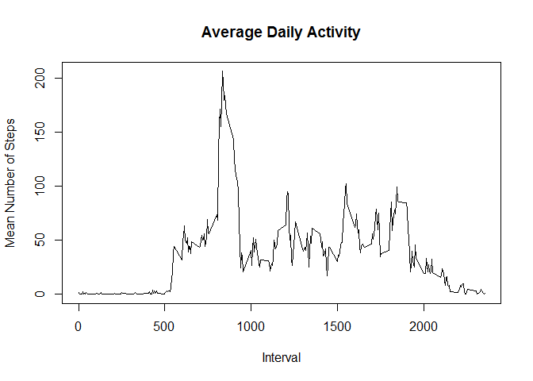
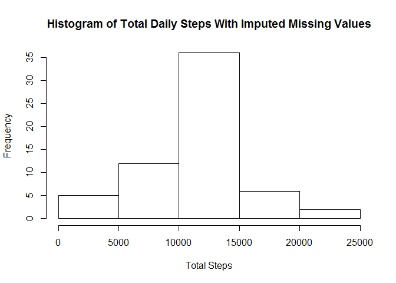
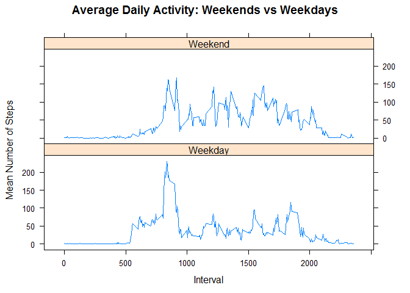

# Reproducible Research: Peer Assessment 1
Jason Jones  


## Loading and preprocessing the data
After cloning the repository, I manually unzipped the data file to bypass temp storage and unzip. To load the data from that point I make a simple read_csv() call using the readr package.


```r
library(tidyverse)
```

```
## Warning: package 'tidyverse' was built under R version 3.4.1
```

```
## Loading tidyverse: ggplot2
## Loading tidyverse: tibble
## Loading tidyverse: tidyr
## Loading tidyverse: readr
## Loading tidyverse: purrr
## Loading tidyverse: dplyr
```

```
## Warning: package 'tibble' was built under R version 3.4.1
```

```
## Warning: package 'tidyr' was built under R version 3.4.1
```

```
## Warning: package 'purrr' was built under R version 3.4.1
```

```
## Warning: package 'dplyr' was built under R version 3.4.1
```

```
## Conflicts with tidy packages ----------------------------------------------
```

```
## filter(): dplyr, stats
## lag():    dplyr, stats
```

```r
x <- read_csv("data/activity.csv")
```

```
## Parsed with column specification:
## cols(
##   steps = col_integer(),
##   date = col_date(format = ""),
##   interval = col_integer()
## )
```


## What is mean total number of steps taken per day?
Aggregate steps by day and create a histogram from the new object.


```r
x2 <- aggregate(x$steps, list(Date=x$date), FUN=sum, na.rm = TRUE)
colnames(x2) <- c("date", "steps")
hist(x2$steps, freq = TRUE, main = "Histogram for Daily Steps", xlab = "Total Steps")
```

<!-- -->


```r
mean.steps <- round(mean(x2$steps), digits = 0)
median.steps <- round(median(x2$steps))
```

Mean steps per day is 9,354 and median steps per day is 10,395.

## What is the average daily activity pattern?
Aggregate the average number of steps by interval and plot it as a time series.


```r
mean.interval <- aggregate(x$steps, by=list(interval=x$interval), FUN=mean, na.rm = TRUE)
colnames(mean.interval) <- c("interval", "steps")
plot(mean.interval$interval, mean.interval$steps, type="l", xlab="Interval", ylab="Mean Number of Steps", main="Average Daily Activity")
```

<!-- -->


```r
index <- which.max(mean.interval$steps)
max.interval <- mean.interval$interval[index]
```

The interval containing the maximum number of steps, on average, is interval 835.

## Imputing missing values

```r
steps2 <- rep(0, length(x$steps));
for (i in 1:length(x$steps)) {
  if (is.na(x$steps[i])) {
    # Compute the index of the interval
    hr = trunc(x$interval[i]/100)
    min = x$interval[i] - 100*hr
    idx = hr * 12 + min/5 + 1
    # And set to corresponding mean
    steps2[i] = mean.interval$steps[idx]
  }
  else {
    steps2[i] = x$steps[i]
  }
}
# Create the new dataset
x.imp <- data.frame(steps=steps2, date = x$date, interval = x$interval)

# Now aggregate and plot the histogram
total.per.day <- aggregate(x.imp$steps, by=list(date=x.imp$date), FUN=sum, na.rm = TRUE)
names(total.per.day) <- c("date", "steps")
hist(total.per.day$steps, freq=TRUE, main="Histogram of Total Daily Steps With Imputed Missing Values", xlab="Total Steps")
```

<!-- -->


```r
mean.steps.per.day <- round(mean(total.per.day$steps))
median.steps.per.day <- round(median(total.per.day$steps))
```


## Are there differences in activity patterns between weekdays and weekends?

```r
x.imp$daytype <- factor(ifelse (weekdays(x.imp$date) %in% c("Saturday", "Sunday"),"Weekend","Weekday"))

mean.per.interval <- aggregate(x.imp$steps,
                               by=list(interval=x.imp$interval, daytype=x.imp$daytype),
                               FUN=mean)
names(mean.per.interval) <- c("interval", "daytype", "steps")


library(lattice)
xyplot(steps ~ interval | daytype, data = mean.per.interval, type="l", layout = c(1, 2),
       xlab="Interval", ylab="Mean Number of Steps",
       main="Average Daily Activity: Weekends vs Weekdays")
```

<!-- -->

